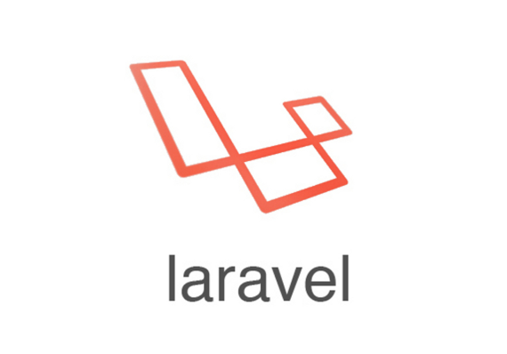
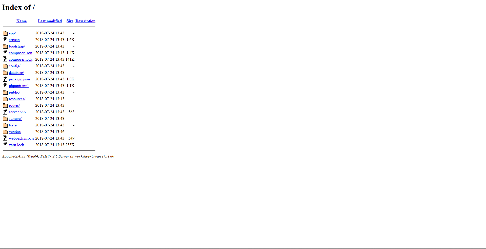
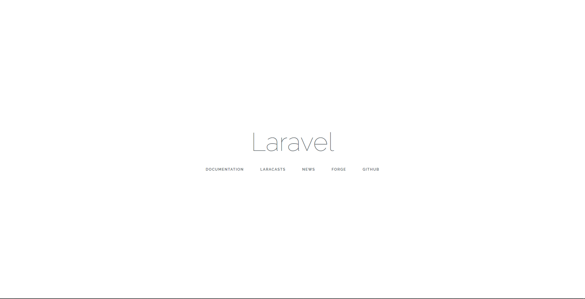

# Workshop Laravel



## Introduction
### Qu'est-ce que Laravel ?

Laravel est un CMS en PHP qui permet de créer un site en suivant un modèle MVC et qui est basé sur Symphony. Sa grosse différence avec WordPress est que Laravel fonctionne de manière beaucoup moins visuelle pour le développeur, ayant une configuration et un développement plus orienté Back-End.
Laravel a une gestion de base de donnée ainsi que de page html propre à elle, que nous verrons plus loin.
Car avant de commencer, installons Composer.

### Composer ? Kézako ? Et quelle nécessité ?


En effet, pour Installer et utiliser Laravel et ses différentes fonctionnalités, il faut tout d'abord utiliser Composer. Et ce dernier est à PHP ce que NPM est à Node.JS. C'est un gestionnaire de dépendances qui permet d'installer, comme sa fonction l'indique, des dépendances et donc des packages de fonctionnalités que l'on peut comparer aux modules Node.JS.

Pour l'installer, suivez le guide: https://getcomposer.org/download/

A présent que Composer est installé, passons à la suite.

### Installation de Laravel

Maintenant que Composer est installé, nous allons nous rendre dans le dossier www contenant nos projets habituels afin de créer notre projet.

!!Attention!! Vérifiez à posséder la version la plus récente de PHP.

ouvrez votre terminal et tapez :
```shell
composer global require "laravel/installer"
```

Quand celà est fait, tapez : 
```shell
laravel new nom-de-projet
```

(Pour une fois vous pouvez copier-coller).

Composer va alors initialiser un nouveau projet contenant Laravel.
Vous voulez voir ce que vous avez créé ? Allez sur votre Localhost et ouvrez le dossier contenant le projet (ou ajoutez le sur wamp si vous êtes sur windows, xamp sur mac).
Vous arriverez sur un index ressemblant à ça : 



L'index ne se trouvant pas à la racine du dossier, c'est parfaitement normal. Pour voir la page, vous devez vous déplacer dans le dossier public eeeeeet Tadam ! Magie ! Vous devriez arriver sur quelque chose comme ceci: 



Effectivement, ça change de l'écran d'acceuil de WordPress. Maintenant que tout celà est fait, entrons dans le vif du sujet: Comment qu'on développe en Laravel ?

## Réalisation d'un formulaire 

Rien de tel qu'un bon formulaire pour commencer n'est-ce pas ? (RIP Hacker Poulette).
Tout d'abord, on va voir comment se fait le front-end !
Et pour créer une page formulaire qui comprend l'architecture, il faut utiliser une dépendance de Laravel, j'ai nommé Laravel Collective.

### Installation de Laravel Collective

Pour installer la dépendance, allez dans le fichier composer.json à la racine du dossier et dans require ajoutez une virgule au dernier argument, puis ajoutez la ligne :

```JSON
"laravelcollective/html":"^5.4.0"
```

Quand c'est fait, ouvrez votre terminal dans le dossier et exécutez la commande : 
```shell
composer update
```
L'installation de la dépendance va alors se lancer.
Ensuite allez dans config/app.php et ajoutez dans "providers" :
```php
Collective\Html\HtmlServiceProvider::class,
```
et dans aliases (toujours dans le fichier app.php) :
```php
'Form' => Collective\Html\FormFacade::class,
'Html' => Collective\Html\HtmlFacade::class,
```

### Création de la page contenant le formulaire

Il faut savoir une chose avant de commencer à faire notre page: 
Laravel gère ses pages de manière propre en passant par son système appelé "Blade"


(non pas celui-là)

Aussi, on ne crée pas une page n'importe où dans Laravel, il faut aller dans: 
```
resources/views 
```
Où se trouve déjà un fichier welcome.blade.php
Vous pouvez créer un nouveau fichier dans views qu'on va appeler form.blade.php

Ensuite, vous pouvez le remplir avec de l'HTML mais n'allez pas plus loin que la balise body.
Dans celle-ci, on va créer le formulaire en ajoutant ces lignes : 

```php
{!! Form::open() !!}

{!! Form::close() !!}
```

Pour ce qui est de ce qu'on vient d'écrire, c'est l'équivalent en html à : 
```html
<form>

</form>
```

Il faut maintenant ajouter des inputs à notre formulaire. Disons un input texte et un bouton.
Entre les lignes de ce qu'on à écrit auparavant, on va donc ajouter : 
```php
    {{Form::text('name', null)}}
    {{Form::submit('send!', null)}}
```

(le "null" spécifie que la valeur de base n'existe pas, ce sera différent si on fait un formulaire qui édite par exemple un post d'un blog préalablement créé)
Tout ça c'est bien, mais si à partir de l'index on navigue jusque là, on voit que ça ne fonctionnne pas. Pourquoi ? Parce qu'aucune route et aucun controller ne prend en charge l'affichage. On va donc en créer un !

### Stairway to heaven 

Une route, c'est comme un routeur en MVC, mais avec de la testostérone en plus. Allez dans le dossier routes et ouvrez web.php.
Vous devez avoir quelque chose qui ressemble à ça: 

```php
Route::get('/', function () {
    return view('welcome');
});
```
Retirez welcome pour mettre form et retournez dans l'index de votre navigateur puis sur le fichier public et Hop !
Vous voilà avec un formulaire ! 
Vous remarquerez que lorsque l'on tappe n'importe quoi, rien ne se passe ! C'est parce qu'il nous manque toujours le controller ainsi que la base de donnée qui va dialoguer avec le formulaire. Pour créer un controller, Laravel va créer les fichiers demandés en passant par le terminal !

dans le projet, on tape dans le terminal :
```shell
php artisan make:controller Formcontroller
```

Vous allez voir que dans votre projet, un nouveau fichier s'est créé dans app/Http/controller et qui s'appelle Formcontroller.php .

Dans le fichier controller, nous avons donc une classe Formcontroller qui est vide. Nous allons donc lui dire qu'il faut enregistrer les informations données par l'utilisateur dans la base de donnée.

### Configurer la base de données et la migration.

Dans votre phpmyadmin, créez une nouvelle base de donnée que vous allez nommer workshop et que vous réglez en utf8-general-ci. Ensuite, dans votre éditeur, ouvrez le fichier .env que vous avez à la racine de votre dossier et localisez ces lignes: 

```
DB_DATABASE=homestead
DB_USERNAME=homestead
DB_PASSWORD=secret
```

Dans DB_DATABASE, mettez le nom de la base de donnée, username le pseudo pour vous connecter à la DB (celui de phpmyadmin) et dans password le mot de passe phpmyadmin de sorte que ça ressemble à celà: 

```
DB_DATABASE=workshop
DB_USERNAME=rootouvotrepseudojem'enfous
DB_PASSWORD=motdepasse
```

Celà va permettre à Laravel de se connecter automatiquement à votre Base de donnée. mais maintenant il faut lui dire de remplir la base de donnée avec des colones. Pour ce faire, on utilise le terminal ouvert dans le dossier de notre projet et tappez :

```shell
php artisan make:migration workshop --create=workshop
```

( 
```shell
php artisan make:migration worshop --table=workshop
```

permettant l'édition d'une table déjà existante dans la Base de données).

Dans le dossier database/migrations, vous allez voir un nouveau fichier à la date d'aujourd'hui suivi du nom workshop. Ouvrez-le pour prendre connaissance de son contenu.

La fonction up permet d'ajouter des colonnes à la table et down d'en retirer. Nous voulous ajouter name, on va donc faire : 

```php
public function up()
    {
        Schema::create('workshop', function (Blueprint $table) {
            $table->increments('id');
            $table->string('name', 250)->unique();
            $table->timestamps();
        });
    }
```
qui, dans la colonne id, incrémente un id qui sera unique et qui, dans la colonne name, aura un name unique limité à 250 caractères, et qui sera un string.

on va retourner dans le dossier app et on va créer un fichier nommé Workshop.php (!! le même nom que la table, c'est hyper important sinon ça ne marchera pas, en revanche mettez une majuscule).

on va mettre dans le fichier: 

```php
<?php

namespace App;

use Illuminate\Database\Eloquent\Model;

class Workshop extends Model {
    public $table = "workshop";
    protected $fillable = ['name'];
}
```
Ce qui va indiquer à laravel que l'on peut ajouter un name dans la base de donnée car la colonne name est remplissable (d'où $fillable).

Maintenant que l'on a dit à Laravel qu'on va ajouter un ID et une colonne name et que cette dernière est remplissable, on doit faire en sorte que ça crée le tout dans la base de donnée. Pour se faire, toujours dans le terminal, tappez: 

```shell
php artisan migrate
```

(Si celà vous rend une erreur parlant d'email, allez dans le dossier Database/migration et dans la migration create_user, modifiez la ligne qui crée un email comme ceci: 

```php
$table->string('email', 250)->unique();
```
supprimez les tables créées dans la base de données workshop et relancez la commande php artisan migrate.)

quand celà est fait, réactualisez phpmyadmin et vous verez que les nouvelles tables sont créées.

Maintenant que c'est fait, on a d'une part la base de donnée qui est prête et d'autre part le formulaire aussi. Il faut maintenant que les deux communiquent ensemble. Celà se fait par la biais du controller.

### Configurer le controller

On va devoir dire au controller d'enregistrer les données dans la base de donnée. Pour celà on va créer une fonction store qui va tout récupérer du formulaire et enregistrer dans la base de donnée.
On va donc ajouter quelques lignes pour que le controller ressemble à : 

```php
<?php

namespace App\Http\Controllers;
use App\Workshop;
use Illuminate\Http\Request;
use App;

class Formcontroller extends Controller
{
    public function store (Request $request) {
        $data = Workshop::create($request->all());
        return back();
    }
}
```
(le return back() permet de revenir sur le formulaire quand celui-ci a été correctement envoyé)

 tout celà est bien beau, on sait maintenant enregistrer des données mais le lien entre l'enregistrement et le formulairte n'est pas encore fait.

### Mise à jour des routes

 On va donc retourner dans le dossier routes puis dans le fichier web.php et on va ajouter: 

 ```php
Route::post('form/store', 'Formcontroller@store');
```

Cette route va spécifier que quand on arrive à l'url nomdeprojet/public/form/store, on envoie le tout au controller qui va se charger d'envoyer à la fonction store pour la sauvegarde dans la base de donnée.

Encore faut-il aller à cette url. Retournez dans form.blade.php et dans 

```php
{{ Form::open() }}
```

on va rajouter la redirection comparable à l'action d'un form html.

```php
{{ Form::open(['url' = 'form/store']) }}
```

Enregistrez, actualisez votre page web et testez votre formulaire !
Vous devriez voir dans votre base de donnée les nouvelles données apparaître !

# Fin